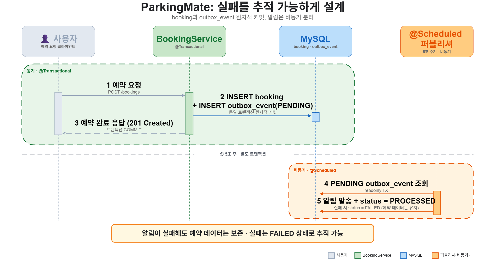
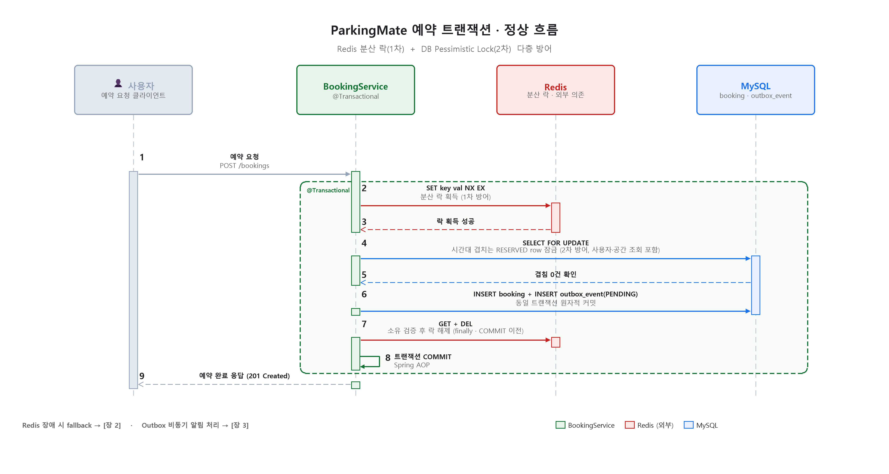
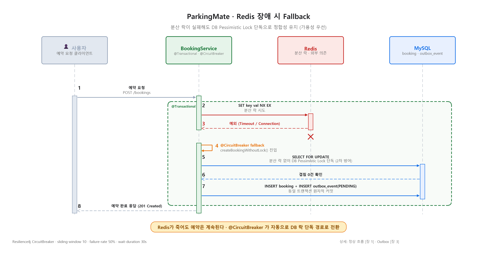
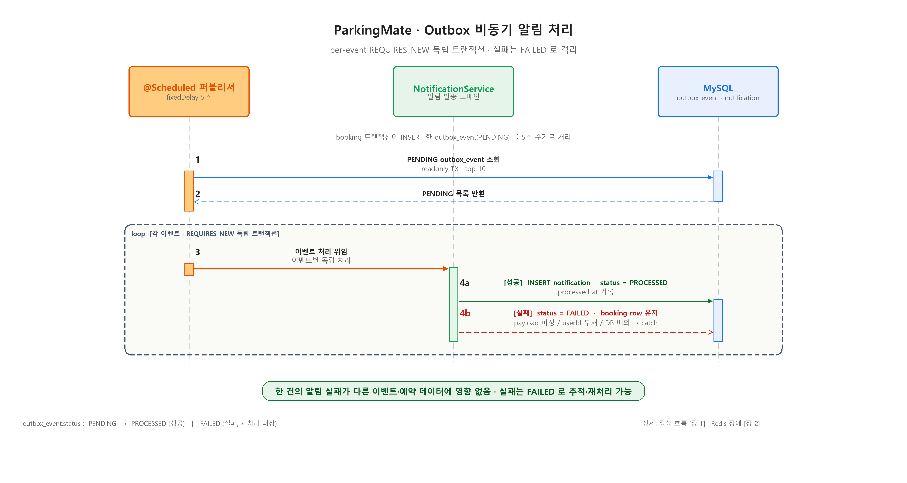

# 🅿️ ParkingMate ｜ P2P 주차 공간 예약 백엔드

> Spring Boot 3.5 / Java 21 기반의 P2P 주차 예약 백엔드.
> 기존 주차 공유 앱이 풀지 못한 세 가지 백엔드 본질 문제 (이중 예약 방지, 예약·알림 원자성, 지리공간 검색 효율) 를 Kafka·EKS 없이 RDBMS 깊이로 해결한 개인 프로젝트.

🇬🇧 영문: [README.en.md](README.en.md) ｜ 📜 v1 보존본: [README_v1_legacy.ko.md](README_v1_legacy.ko.md)

---

## 📋 프로젝트 요약



> 위 다이어그램: 예약 트랜잭션(동기, `@Transactional`) 안에서 `booking` 과 `outbox_event` 를 같은 커밋에 묶고, 알림 발행은 5초 주기 `@Scheduled` 퍼블리셔로 비동기 분리. 알림이 실패해도 예약 데이터는 보존되고 실패는 `FAILED` 상태로 추적 가능.

| 항목 | 내용 |
|---|---|
| 한 줄 | P2P 주차 예약 백엔드, 본질 3대 문제 RDBMS 깊이 해결 |
| 역할 | **단독 풀스택** (백엔드, 프론트엔드, 인프라, DevOps) |
| 기간 | 2025.12 ~ 2026.03 |
| 핵심 기술 | Spring Boot 3.5.3 · MySQL 8 R-Tree Spatial Index · Redis GEO · Lettuce 기반 Spring Data Redis · Resilience4j · Transactional Outbox |
| 검증된 자산 | Outbox 트랜잭션 분리 (Hikari 점유 분산 ratio 1.6× → 1.2×) · MySQL Spatial Index (EXPLAIN 9,880 → 378, 96.2% 감소) · 통합 테스트 8/8 PASS |
| 의도적 제외 | Kafka, EKS (다른 포트폴리오 Clmakase·INSK 에서 검증, 이 프로젝트는 RDBMS 깊이 piece) |
| 리팩토링 | DDD 47파일 패키지 재구성 (commit `1f74025`, BUILD SUCCESSFUL 유지) |

---

## 🏙 어떤 문제를 풀고 있나? (배경 · AS IS / 5 Why)

### 표면 문제

도심 운전자는 주차장을 찾는 데 시간을 쓰고, 개인이 보유한 빈 공간은 거래 가능한 자산으로 연결되지 못한 채 방치됩니다. 도시 교통량의 약 30%가 주차 공간을 찾는 차량입니다. 한국의 대표 서비스 "모두의 주차장" 은 상업 주차장 디렉토리에 가까워, 방치된 개인 공간을 실시간 거래 가능한 자산으로 만드는 영역은 여전히 빈 시장입니다.

### 5 Why 로 한 단계 내려가면

| 질문 | 답 |
|---|---|
| 왜 P2P 주차 공유 서비스가 한국 시장에 자리잡지 못했나 | 단순 매칭 UX 만 가지고는 신뢰 문제가 풀리지 않음 |
| 왜 신뢰 문제가 백엔드에서 자주 새는가 | 동시 요청, 외부 모듈 장애, 위치 검색 비효율 같은 본질 갭이 표면에서 안 보이게 누적 |
| 왜 그 갭이 기존 앱에서 닫히지 않았나 | 메시지 브로커, 마이크로서비스, 운영 메트릭 같은 인프라 비용을 먼저 들이지 않고는 풀기 어렵다고 가정함 |
| 그 가정이 맞나 | 트래픽·도메인 규모에 따라 단일 RDBMS 의 깊이만으로도 동일한 정합성 보장이 가능함 |

이 분석을 바탕으로 ParkingMate 는 다음 세 가지 엔지니어링 gap 을 직접 닫는 방식으로 풀었습니다.

| 문제 | 기존 앱의 한계 | ParkingMate 의 해결 |
|---|---|---|
| **이중 예약 방지** | 두 사용자가 동시에 같은 시간대를 예약 시 락이 없으면 둘 다 성공 | 트랜잭션 안 Redis 분산 락 (Lettuce SET NX EX, 자기 소유 검증 후 DEL) + DB Pessimistic Lock (`SELECT FOR UPDATE`) 다층 방어 |
| **예약·알림 원자성** | 예약은 성공했는데 알림이 사라지는 Dual-Write 문제 (사용자는 게이트에서 발견) | Transactional Outbox 패턴, booking + outbox_event 같은 트랜잭션 커밋, `@Scheduled` publisher 가 at-least-once 로 발송 |
| **지리공간 검색 효율** | 주변 주차 찾기가 풀 테이블 스캔 + Java Haversine 거리 계산, 카탈로그 수천 개 넘으면 급격히 악화 | MySQL Spatial Index (POINT SRID 4326 + R-Tree) + Redis GEO write-through 캐시 |
| **Redis 단일 장애** | 분산 락 실패 시 예약 전체 차단 | Resilience4j Circuit Breaker 가 DB Pessimistic Lock 단독 경로로 자동 폴백 |

전체 의사결정 흐름: [MD/PARKINGMATE_STRATEGY_V2_0304.md](MD/PARKINGMATE_STRATEGY_V2_0304.md)

---

## 📏 검증된 측정 결과

모든 측정은 `BookingConnectionTimingTest` 와 `ParkingMateIntegrationTest` 로 실 MySQL 8.0 (Docker `localhost:3307`) + Redis 7 환경에서 수행. 재현 방법은 [로컬 실행](#-로컬-실행) 참조.

### Hikari 커넥션 점유 분산 (10회 반복)

| Case | 설명 | TX 내 DB 쿼리 | 평균 | 범위 | 분산 ratio | 알림 실패 시 예약? |
|---|---|---|---|---|---|---|
| Case 1 | Baseline (알림 없음) | 4 | 33 ms | 28~41 ms | 1.5× | 보존 |
| Case 2 | 문제 재현 (알림이 같은 TX 내부) | 6 | 37 ms | 32~51 ms | 1.6× | ❌ 롤백 |
| **Case 3 (After)** | **Outbox (알림 별도 publisher)** | **5** | **36 ms** | **33~40 ms** | **1.2×** | ✅ **보존** |

> **헤드라인 수치는 분산, 평균이 아닙니다.** localhost 절대값은 37 → 36ms 로 1ms 차이라 통계적 노이즈 수준입니다. 본질은 min-max ratio 가 1.6× 에서 1.2× 로 좁아진 점입니다. 알림 서브시스템 부하가 더 이상 예약 latency 에 새지 않습니다.
>
> RDS-style 10ms/쿼리 네트워크 가정 외삽: 같은 변경이 60ms → 50ms 점유 시간 단축, 100 동시 요청 + 10 커넥션 Hikari 풀 시나리오에서 처리량 약 +17% 의 **수식 외삽**입니다. JMeter·k6 실측 부하 테스트는 미수행입니다.

### EXPLAIN ｜ 지리공간 검색 (10,000행 샘플 데이터셋)

| | Before (`lat/lng` BETWEEN) | **After (R-Tree `ST_Within`)** |
|---|---|---|
| `EXPLAIN.type` | `ALL` (풀 테이블 스캔) | **`range` (인덱스 범위 스캔)** |
| `EXPLAIN.key` | `NULL` | **`idx_location`** |
| Rows scanned | 9,880 | **378** |
| `filtered` | 1.23% | **100%** |
| 실행 시간 | 3.30 ms | 2.42 ms |

> **스캔 행수 96.2% 감소.** 10K 행에서는 InnoDB 버퍼풀에 다 들어가서 시간 차이가 작습니다. 1M 행 디스크 I/O 환경이라면 같은 구조 변경이 38,000 행 스캔 vs 1M 행 풀 스캔 + 디스크 I/O 가 됩니다. orders of magnitude 차이로 확대된다는 추정의 기반선입니다. EXPLAIN 출력 원본 스크린샷은 별도 보존하지 않았습니다.

### 통합 테스트 (`ParkingMateIntegrationTest`, 8/8 PASS)

| # | Case | 검증 내용 |
|---|---|---|
| 0 | Setup | 사용자 2명, ParkingSpace 2개 (서울 강남 + 부산 해운대) |
| 1 | Outbox-1 | 예약 생성 시 `outbox_event` 1행이 같은 T1 안에 `PENDING` 으로 기록 |
| 2 | Outbox-2 | publisher 실행 후 `notification` 행 생성 + outbox 행 `PROCESSED` 로 전이 |
| 3 | Outbox-3 | 손상된 payload 가 dispatch 에서 throw, outbox `FAILED`, **예약은 보존** |
| 4 | Spatial-1 | 강남역 5km 반경: 강남 space 포함, 부산 space 제외 |
| 5 | Spatial-2 | 1km 반경: 부산 여전히 제외 |
| 6 | GEO-1 | Redis `GEOADD` write-through, `GEOSEARCH` 가 정확한 space 만 반환 |
| 7 | Concurrency | CountDownLatch 2 스레드 경합, 정확히 1개 `SELECT FOR UPDATE` 성공 |

JUnit XML 보존: `build/test-results/test/TEST-...IntegrationTest.xml` (Java 21.0.6, profile `mysqltest`, MySQL 8 + Redis 7 Docker, 호스트 `DESKTOP-24C2CU9`)

---

## 🏛️ 시스템 아키텍처

### 1. 예약 트랜잭션 정상 흐름



`@Transactional` 메서드 안에서 Redis 분산 락(1차 방어) 과 DB Pessimistic Lock (2차 방어) 을 다층으로 잡습니다. `booking` INSERT 와 `outbox_event` INSERT 가 동일 트랜잭션에 원자적으로 커밋되고, Redis 락은 `finally` 블록의 자기 소유 검증 후 COMMIT 이전에 해제됩니다.

### 2. Redis 장애 시 Fallback



Redis 분산 락 호출에서 예외 발생 시 `@CircuitBreaker(name="redis-lock", fallbackMethod="createBookingWithoutLock")` 가 자동으로 fallback 메서드를 호출합니다. 분산 락 없이 DB Pessimistic Lock 단독으로 진행되어 가용성과 정합성을 동시에 확보합니다.

Resilience4j 설정: sliding-window 10, failure-rate 50%, wait-duration 30s.

### 3. Outbox 비동기 알림 처리



`@Scheduled(fixedDelay = 5000)` 퍼블리셔가 PENDING 이벤트를 readonly 트랜잭션으로 최대 10건 조회한 뒤, 각 이벤트를 `REQUIRES_NEW` 독립 트랜잭션으로 처리합니다. 한 이벤트의 실패가 다른 이벤트에 전파되지 않습니다. 알림 처리 중 예외 (payload 파싱 실패, userId 부재, DB 예외) 발생 시 outbox 행을 `FAILED` 로 마킹하고 `booking` 데이터는 그대로 보존됩니다.

### 시각 자료 진행 상태

- ✅ 예약 시퀀스 (`sequence-booking.png`)
- ✅ Redis 장애 fallback (`fallback.png`)
- ✅ Outbox 비동기 처리 (`outbox.png`)
- ✅ 요약 데이터 플로우 (`summary.png`)
- 📌 제작 예정: ParkingMate UI 메인 페이지 캡처
- 📌 제작 예정: R-Tree Spatial Index 검색 영역 지도 시각화
- 📌 제작 예정: DDD 47파일 패키지 구조도

---

## ✅ 구현 완료 (Implemented)

- Transactional Outbox 패턴 (`booking` + `outbox_event` 원자적 커밋, `@Scheduled(fixedDelay=5000)` publisher, `REQUIRES_NEW` per-event)
- Pessimistic Lock (`@Lock(LockModeType.PESSIMISTIC_WRITE)` + JPQL overlap 쿼리) 과 Lettuce 기반 Redis 분산 락 다층 방어
- Resilience4j Circuit Breaker (sliding-window 10, failure-rate 50%, wait 30s) + Bulkhead (max-concurrent 20)
- Redis 장애 시 `createBookingWithoutLock` 자동 fallback (DB Pessimistic Lock 단독)
- MySQL POINT/SRID 4326 + R-Tree SPATIAL INDEX 지리공간 검색 (`ST_Within` + `ST_Distance_Sphere` 두 단계 필터)
- Redis GEO write-through 캐시 (`GEOADD` / `GEOSEARCH` / `ZREM`) 와 MySQL Spatial fallback
- DDD 47파일 도메인 패키지 리팩토링 (`user` / `space` / `reservation` / `notification` / `common`, BUILD SUCCESSFUL 유지)
- 통합 테스트 8건 정상·예외 흐름 검증 (Outbox 3, Spatial 2, GEO 1, Concurrency 1, Setup 1)
- JWT 인증 + Spring Security STATELESS + BCrypt
- 프론트엔드 최소 CRUD (React 19 + Vite + axios `/api` proxy)
- Terraform: VPC, 2x Public·Private Subnet, NAT GW, SG (ALB·App·RDS·Redis·Bastion), ALB+TG+Listener, S3, ECR

## 🚧 설계 완료 / 진행 중 (Designed / In Progress)

- 🚧 **Outbox idempotency key** : Consumer 측 unique constraint (`notification.outbox_event_id`) 추가는 Designed, 미구현. 현재는 at-least-once 까지
- 🚧 **FAILED 자동 재처리 워커** : exponential backoff + max retry 정책은 Designed, 현재 코드는 FAILED 상태 보존까지
- 🚧 **자동화 Chaos 테스트** : Redis 컨테이너 docker stop 수동 검증까지 완료, ToxiProxy 같은 자동화는 다음 단계
- 🚧 **DDD aggregate boundary** : 도메인 패키지 응집도까지 적용, 정식 aggregate root 명시와 Repository per aggregate 규칙은 다음 단계
- 🚧 **CI/CD deploy stage** : Terraform 인프라 골격까지, ECS Fargate 자동 배포는 deploy stage 가 echo placeholder 단계

## 📋 로드맵 (Planned)

### v2
- [ ] CI/CD deploy stage (ECS Fargate 자동 배포)
- [ ] 사진 증거 시스템 (출차 시 차량 위치 사진 업로드, S3 + presigned URL)
- [ ] 운영 메트릭 (Prometheus + Grafana, TPS, P99, 락 점유 시간)
- [ ] 알림 채널 확장 (현재 in-app 만, SMS·푸시 추가)
- [ ] JMeter·k6 실측 부하 테스트

### 장기
- [ ] 머신러닝 추천 (사용자 예약 패턴 기반)
- [ ] 다중 region (Redis GEO 분산 정합성)

---

## 🔧 의도적으로 안 한 것

- ❌ **Kafka** ｜ 다른 포트폴리오 (Clmakase) 에서 3-Broker StatefulSet 으로 검증됨. 여기서 다시 도입하면 over-engineering
- ❌ **EKS / Kubernetes** ｜ 위와 동일 이유
- ❌ **마이크로서비스 분리** ｜ 단일 모듈 안에서 DDD 패키지 격리로 충분
- ❌ **Redisson** ｜ Lettuce 기반 Spring Data Redis 의 `setIfAbsent` (SET NX EX) + 자기 소유 검증 후 DEL 로 단순화. 단일 노드 Redis 단계의 의도적 선택. Redisson 클러스터, watchdog 자동 갱신은 트래픽이 그 단계에 갔을 때 도입
- ❌ **운영 메트릭 (TPS, P99)** ｜ Hikari 분산 측정과 EXPLAIN 측정만이 검증 자산
- ❌ **JMeter·k6 실측 부하 테스트** ｜ 처리량 외삽은 풀 점유 시간 기반 수식 계산이고 실측 아님

이 프로젝트는 RDBMS 깊이 들어가는 piece 입니다. 다른 인프라 깊이는 다른 프로젝트에서 보여드립니다.

---

## 🛠 기술 스택

| 영역 | 기술 |
|---|---|
| 백엔드 | Java 21, Spring Boot 3.5.3, Spring Data JPA, Spring Security, jjwt 0.11.5 |
| DB · 캐시 | MySQL 8.0 (POINT SRID 4326 + R-Tree), Redis 7 (GEO + Lettuce 기반 분산 락) |
| 공간 라이브러리 | Hibernate Spatial, JTS Core 1.19.0 |
| 신뢰성 | Transactional Outbox, Pessimistic Lock, Resilience4j 2.2.0 (CircuitBreaker + Bulkhead) |
| 테스트 | JUnit 5, Spring Boot Test, CountDownLatch 2 스레드 경합 |
| 프론트엔드 | React 19, Vite 7, axios, react-router-dom |
| 인프라 (Terraform) | VPC, 2x Public/Private Subnet, NAT GW, ALB, ECR, S3 (v2 에서 ECS 자동 배포 예정) |
| CI/CD | GitHub Actions (backend·frontend test → build → ECR push) |

---

## 👤 역할 및 담당 (단독)

| 영역 | 담당 사항 |
|---|---|
| 백엔드 (Java 21 / Spring Boot 3.5.3) | 도메인 모델링, 리포지토리 설계, 트랜잭션 경계 |
| 동시성 설계 | Pessimistic Lock + Outbox + Resilience4j 합성, fallback 메서드 설계 |
| DB 엔지니어링 | MySQL Spatial Index 설계, EXPLAIN 기반 최적화, JPA / JTS 통합 |
| 캐싱 | Redis GEO write-through, Lettuce 기반 분산 락 primitive |
| 프론트엔드 (React 19 / Vite 7) | 주차 흐름 최소 CRUD UI |
| 인프라 (Terraform) | VPC / ALB / ECR / S3 모듈 |
| CI/CD (GitHub Actions) | backend·frontend test → build → ECR push (v2 에서 deploy stage 추가 예정) |
| 문서화 | 전략 문서, before/after 측정 리포트, 통합 테스트 리포트 |

---

## 🏗 로컬 실행

### 사전 조건

- Java 21
- Docker, Docker Compose
- Node.js 18 이상 (frontend)

### 백엔드

```bash
# DB + Redis 컨테이너 기동
cd ParkingMate
docker-compose up -d mysql redis

# 백엔드 실행
cd ParkingMate/parkingmate
./gradlew bootRun
```

### 프론트엔드

```bash
cd ParkingMate/parking-mate-frontend
npm install
npm run dev
# http://localhost:5173 (Vite proxy 가 /api 를 localhost:8080 으로 우회)
```

### 측정·테스트 재현

```bash
# 측정용 MySQL (port 3307) + Redis 컨테이너 기동
docker start parkingmate-mysql-test parkingmate-redis

# 통합 테스트 (8건)
cd ParkingMate/parkingmate
./gradlew test --tests "com.parkingmate.parkingmate.integration.ParkingMateIntegrationTest"

# Hikari 분산 측정 (Case 1/2/3, 각 10회 반복)
./gradlew test --tests "*BookingConnectionTimingTest"

# 결과 리포트
# build/reports/tests/test/index.html
```

---

## 📝 Notes (현재 상태)

- **measurement scope** ｜ localhost MySQL Docker + 단일 스레드 10회 반복. 절대값 비교가 아닌 분산 ratio 비교가 본질
- **EXPLAIN dataset** ｜ 10K 행 샘플. 100만 건 환경 시간 차이는 본문 명시적 추정
- **부하 테스트** ｜ JMeter·k6 실측 미수행. +17% 처리량 수치는 풀 점유 시간 기반 수식 외삽
- **Chaos 테스트** ｜ 자동화 없음. Redis 컨테이너 수동 stop 으로 fallback 동작 확인 단계
- **Outbox 의미론** ｜ at-least-once 보장까지. Consumer 측 idempotency 와 FAILED 자동 재처리는 Designed
- **DDD** ｜ 도메인 패키지 응집도까지. Aggregate boundary 명시는 다음 단계
- **EXPLAIN 출력 원본** ｜ 별도 스크린샷·로그 미보존. v2 에서 재캡처 예정

---

## 📚 저장소 안 참고 문서

- [MD/PARKINGMATE_STRATEGY_V2_0304.md](MD/PARKINGMATE_STRATEGY_V2_0304.md) ｜ 전략 문서 (의사결정 흐름)
- [MD/BEFORE_MEASUREMENT_REPORT.md](MD/BEFORE_MEASUREMENT_REPORT.md) ｜ Hikari 분산과 EXPLAIN before 측정
- [MD/AFTER_MEASUREMENT_REPORT.md](MD/AFTER_MEASUREMENT_REPORT.md) ｜ Outbox 와 Spatial Index after 측정
- [MD/INTEGRATION_TEST_REPORT.md](MD/INTEGRATION_TEST_REPORT.md) ｜ 8/8 통합 테스트 풀 리포트
- [README.en.md](README.en.md) ｜ 영문 버전
- [README_v1_legacy.ko.md](README_v1_legacy.ko.md) ｜ v1 시점 보존본

---

## 🔗 연락처

**박건우 ｜ Backend Engineer**

- 이메일: Gunwoo363@gmail.com
- GitHub: [github.com/gm-15](https://github.com/gm-15)
- Blog: [velog.io/@gm-15](https://velog.io/@gm-15)
